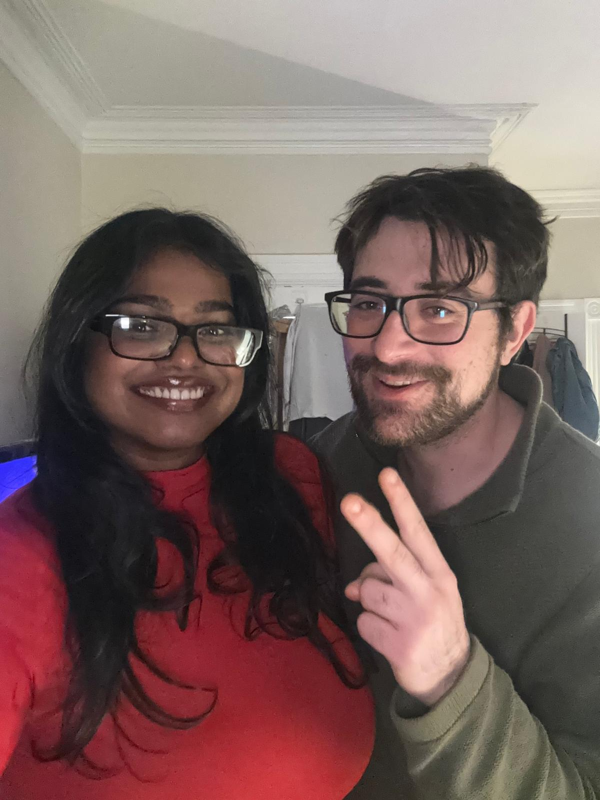
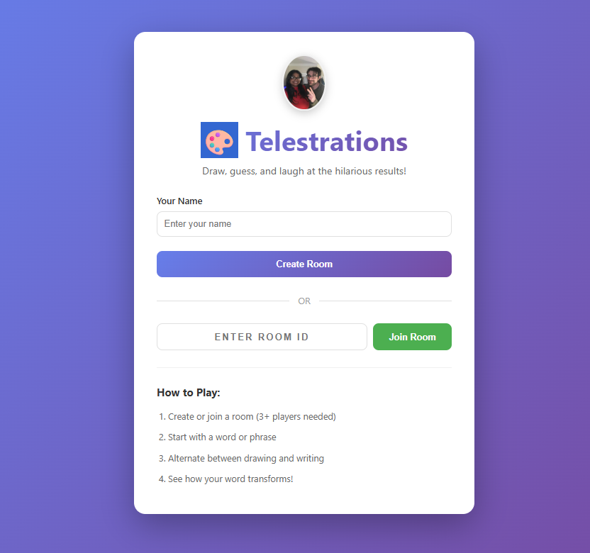
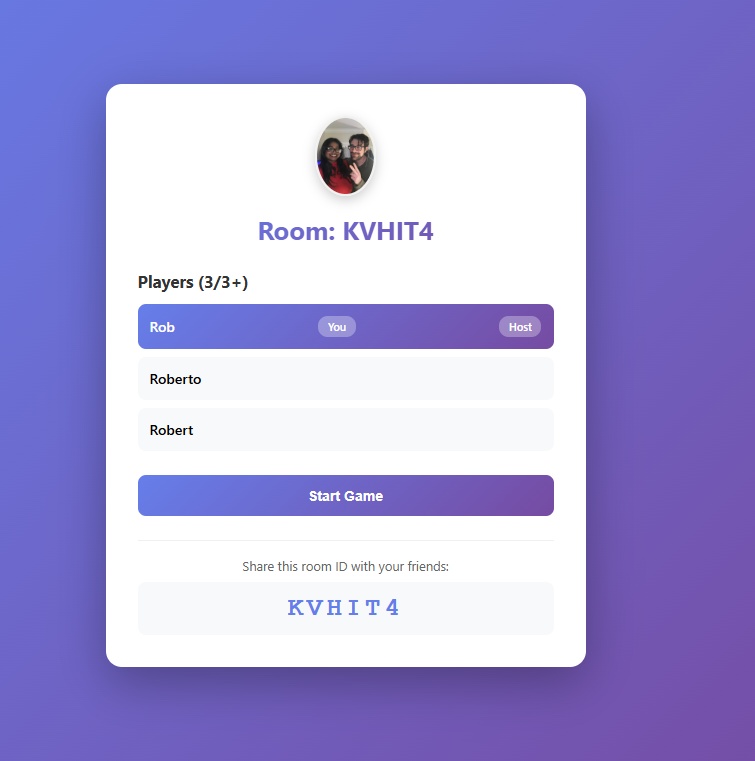
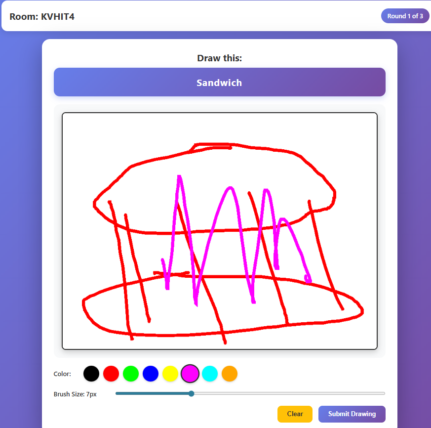
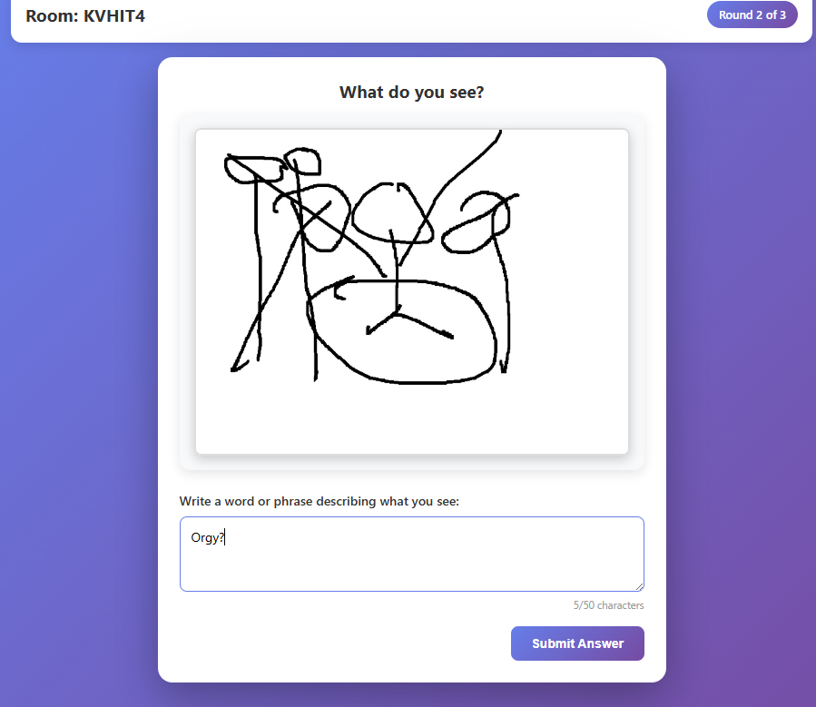
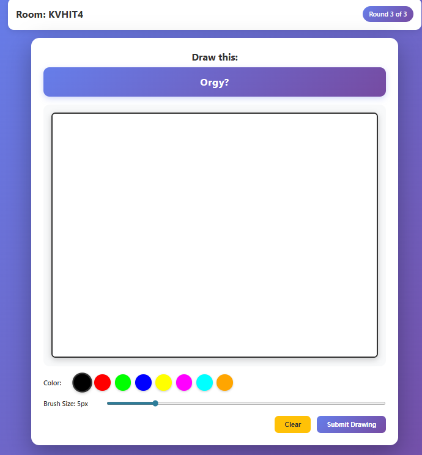

# 🎨 Telestrations - Digital Party Game

A web-based implementation of the classic Telestrations party game. No physical board or pieces needed - just gather your friends online and watch the hilarious transformations unfold!



## 📸 Screenshots

### Home Screen

*Clean, modern interface to create or join game rooms*

### Game Lobby

*Wait for players and see who's ready to play*

### Drawing Canvas

*Interactive drawing canvas with color picker and brush size controls*

### Text Input

*Write what you think the drawing represents*

### Results Screen

*See the hilarious transformation chain of each word!*

## ✨ Features

- 🎮 **Real-time Multiplayer** - Play with friends using WebSocket technology
- 🎨 **Interactive Drawing** - Full-featured canvas with multiple colors and brush sizes
- 📱 **Responsive Design** - Works seamlessly on desktop, tablet, and mobile devices
- 🎯 **Touch Support** - Draw with your finger or stylus on touch devices
- 🎉 **Hilarious Results** - Watch how words transform through everyone's interpretations
- ⚡ **Fast & Reliable** - Built with modern web technologies for smooth gameplay
- 🔄 **Auto-Reconnection** - Automatically reconnects if connection is lost

## 🚀 Quick Start

### Prerequisites

- **Node.js** (v14 or higher) - [Download here](https://nodejs.org/)
- **npm** (comes with Node.js)

### Installation

1. **Clone or download this repository**
   ```bash
   git clone <your-repo-url>
   cd telestrations
   ```

2. **Install root dependencies**
   ```bash
   npm install
   ```

3. **Install client dependencies**
   ```bash
   cd client
   npm install
   cd ..
   ```
   
   Or use the convenience script:
   ```bash
   npm run install-all
   ```

### Running Locally

1. **Start both the server and client**
   ```bash
   npm run dev
   ```
   
   This will start:
   - **Backend server** on `http://localhost:3001`
   - **React frontend** on `http://localhost:3000`

2. **Open your browser**
   ```
   http://localhost:3000
   ```

3. **Start playing!**
   - Create a room or join with a room ID
   - Share the room ID with friends
   - Need at least 3 players to start

## 🎮 How to Play

1. **Create or Join a Room**
   - Click "Create Room" to start a new game
   - Or enter a room ID and click "Join Room"
   - Share the room ID with your friends

2. **Wait for Players**
   - Minimum 3 players required to start
   - Host can start the game when ready

3. **Play the Game**
   - **Round 1**: You'll see a word - draw it!
   - **Round 2**: You'll see a drawing - write what you think it is
   - **Round 3**: You'll see text - draw it again!
   - This alternates for all rounds

4. **See the Results**
   - After all rounds, see how each word transformed
   - Click on any chain to see the full progression
   - Laugh at the hilarious interpretations!

## 📁 Project Structure

```
telestrations/
├── client/                 # React frontend
│   ├── public/            # Static files (logo, favicon)
│   └── src/
│       ├── components/    # React components
│       │   ├── Home.js    # Landing page
│       │   ├── Lobby.js   # Room lobby
│       │   ├── Room.js    # Main game room
│       │   ├── DrawingCanvas.js  # Drawing interface
│       │   ├── TextInput.js      # Text input for guesses
│       │   └── Results.js        # Results/reveal screen
│       ├── App.js         # Main app component
│       └── index.js       # Entry point
├── server/                # Node.js backend
│   └── index.js          # Express + Socket.io server
├── package.json          # Root dependencies
└── README.md            # This file
```

## 🛠️ Tech Stack

### Frontend
- **React 18** - UI library
- **React Router** - Routing
- **Socket.io Client** - Real-time communication
- **HTML5 Canvas** - Drawing functionality
- **CSS3** - Modern styling with gradients and animations

### Backend
- **Node.js** - Runtime environment
- **Express** - Web server framework
- **Socket.io** - WebSocket server for real-time multiplayer
- **CORS** - Cross-origin resource sharing

## 🌐 Running on Network

To play with friends on the same network:

1. **Find your local IP address**
   - Windows: `ipconfig` (look for IPv4 Address)
   - Mac/Linux: `ifconfig` or `ip addr`

2. **Start the server** (it already listens on all interfaces)
   ```bash
   npm run dev
   ```

3. **Access from other devices**
   - Use `http://YOUR_IP:3000` instead of `localhost:3000`
   - Example: `http://192.168.1.100:3000`

4. **Firewall settings**
   - Make sure ports 3000 and 3001 are open
   - Windows Firewall may prompt you - allow access

## 🎯 Tips for Best Experience

- 💡 **Use a tablet or device with a stylus** for better drawing experience
- 📱 **Stable internet connection** recommended for smooth gameplay
- 🎨 **Don't worry about artistic skill** - the worse the drawing, the funnier the results!
- 👥 **Ideal for 4-8 players** for the best experience
- ⏱️ **Take your time** - there's no rush, enjoy the creative process

## 🐛 Troubleshooting

### "Failed to connect to server"
- Make sure the server is running (`npm run dev`)
- Check that port 3001 is not blocked by firewall
- Verify the server console shows: `Server running on http://0.0.0.0:3001`

### "Room not found" or "Failed to join room"
- Make sure the room ID is correct (case-sensitive)
- Verify the game hasn't already started
- Check that the host is still connected

### Drawing not working on mobile
- The canvas supports touch input
- Try using a stylus for better precision
- Make sure you're using a modern browser

### Connection issues on network
- Verify both devices are on the same network
- Check firewall settings allow ports 3000 and 3001
- Try accessing the server directly: `http://YOUR_IP:3001`

## 📝 Available Scripts

- `npm run dev` - Start both server and client in development mode
- `npm run server` - Start only the backend server
- `npm run client` - Start only the React frontend
- `npm run install-all` - Install all dependencies (root + client)
- `npm run build` - Build the React app for production

## 🤝 Contributing

Feel free to submit issues, fork the repository, and create pull requests for any improvements!

## 🚀 Deployment

This app requires both frontend and backend servers. See [DEPLOYMENT.md](./DEPLOYMENT.md) for detailed deployment instructions.

**Quick options:**
- **Render/Railway/Fly.io** - Deploy full stack (recommended)
- **GitHub Pages + Backend Service** - Deploy frontend to GitHub Pages, backend separately
- **Single Service** - Deploy everything to one platform

**Note:** GitHub Pages alone cannot host this app because it requires a Node.js backend for real-time multiplayer via Socket.io.

## 📄 License

MIT License - feel free to use this project for your own purposes!

## 🎉 Have Fun!

Enjoy playing Telestrations! The game is designed to be fun, social, and hilarious. Don't take it too seriously - the best part is seeing how creative (or not!) everyone's interpretations are!

---

**Made with ❤️ for party game enthusiasts**
